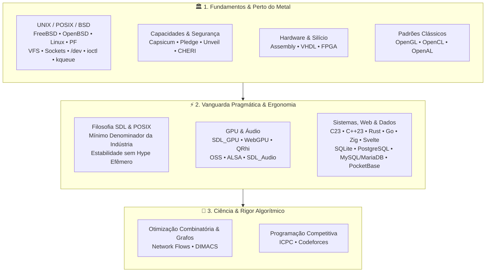

# E aí, eu sou o Gabriel Frigo! 👾

> **Estudante de Ciência da Computação e BC&T na UFABC**<br />
> _Baixa Abstração, Engenharia de Sistemas, Fundamentos de UNIX, Computação Gráfica & Otimização Combinatória_

Seja muito bem-vindo ao meu cantinho no GitHub! Troquei as competições pesadas de matemática e astronomia (onde conquistei algumas medalhas e muita disciplina mental) para me dedicar de corpo e alma ao que realmente faz meu olho brilhar: **entender a computação de ponta a ponta, do silício aos bits que cruzam o kernel até a tela.**

Eu vejo este perfil como a **BIOS do meu ecossistema**: o lugar onde mostro não apenas o código que escrevo, mas o que me apaixona, como penso arquitetura e a diversão pura de construir coisas rápidas, resilientes e elegantes perto do metal.

---

## 🏛️ Meu Laboratório: O Sexteto de Engenharia (Os 6 Hubs)

Para não transformar meu GitHub em uma gaveta bagunçada de códigos soltos, estruturei todo o meu trabalho em torno de **6 ecossistemas federados e soberanos**. Cada um deles resolve uma frente do meu universo de desenvolvimento:

| Hub                                                               | O que acontece por lá?                                                 | Tecnologias Centrais             | Componentes Canônicos                               |
| :---------------------------------------------------------------- | :--------------------------------------------------------------------- | :------------------------------- | :-------------------------------------------------- |
| [**`environment`**](https://github.com/GabrielFrigo4/environment) | Minha estação de trabalho portátil, dotfiles e automações de SO        | POSIX Shell, Elisp, Lua, C       | `Setup`, `Shell`, `Vault`, `Profile`, `Editores`    |
| [**`foundation`**](https://github.com/GabrielFrigo4/foundation)   | Utilitários de sistema, ferramentas de privilégio e acervo canônico    | C99, POSIX.1, LaTeX, Git         | `Sysutils` (`rtdo`/`rtgo`), `Library`, `Raw Text`   |
| [**`research`**](https://github.com/GabrielFrigo4/research)       | Pesquisa acadêmica em Otimização Combinatória e Grafos na UFABC        | C++23, LaTeX, DIMACS             | `Network Flow` (Fluxo Máximo e Custo Mínimo, Livro) |
| [**`training`**](https://github.com/GabrielFrigo4/training)       | Maratonas algorítmicas, desafios extremos e treino competitivo         | C++23, Rust, Python, Bash        | `Algorithms` (Templates, CLI `cpt`), `Marathon`     |
| [**`personal`**](https://github.com/GabrielFrigo4/personal)       | Engines do zero, computação gráfica, servidores de rede e experimentos | C/C++, Rust, SDL3, Lisp, Sockets | `Engines`, `Systems`, `Labs`, `Identity`, `OSS`     |
| [**`venture`**](https://github.com/GabrielFrigo4/venture)         | Soluções de mercado, logística operacional e produtos completos        | Go, Google OR-Tools, PocketBase  | `OptiLaser` (Motor VRPTW & Copiloto)                |

---

## 🧠 Como eu penso Engenharia: A Tríade Canônica

Fujo deliberadamente de dois extremos que considero armadilhas no desenvolvimento:

1. **A alienação das caixas-pretas de altíssimo nível:** Aquela sensação desconfortável de rodar 50 camadas de abstração sem fazer a menor ideia de quanta memória está sendo queimada, de quantos ponteiros estão vazando ou do que o sistema operacional está sofrendo por baixo.
2. **A burocracia bizantina do masoquismo técnico:** Passar três semanas escrevendo 1.500 linhas de boilerplate manual em Vulkan ou DirectX 12 cru só para conseguir a façanha de desenhar um único triângulo na tela.

O que eu busco todos os dias é o **equilíbrio de ouro**: a força inabalável dos fundamentos clássicos aliada à vanguarda pragmática da indústria moderna.



---

## 💡 O que realmente faz meu olho brilhar

### 1. A Poesia do UNIX: Quando tudo é um Descritor e uma Credencial (FD + ID)

Sabe aquele estalo mental inesquecível em que a arquitetura inteira de computação se ilumina na sua frente? Para mim, foi perceber que quase toda a mágica dos sistemas Unix-like (FreeBSD, Linux, OpenBSD) se apoia em apenas duas primitivas absurdamente simples e geniais:

- **File Descriptors (FD):** Onde e como você conversa com o fluxo de dados. Sockets de rede? São FDs. Arquivos no disco, pipes entre processos, nós de dispositivos em `/dev`, multiplexação de eventos em alta escala com `kqueue`/`epoll` e o próprio subsistema de som. Quando o sistema operacional é bem desenhado, **tudo pode e deve ser tratado como um descritor de arquivo**.
    - _O momento em que eu pirei com isso:_ No **OSS (Open Sound System)** do FreeBSD, se você quiser testar o microfone saindo nas caixas, você simplesmente roda no terminal:
        ```sh
        cat /dev/dsp > /dev/dsp
        ```
        E pronto! Sua voz sai nos alto-falantes em tempo real. Sem servidor de áudio mastodôntico consumindo CPU, sem dezenas de camadas intermediárias. É áudio tratado como um stream puro de bytes no VFS. Isso para mim é o ápice da elegância computacional!
- **Identifiers & Credenciais (ID):** Quem é o sujeito executando a ação (UID, GID, EUID, PID) e onde ficam as fronteiras de autorização.

Quando você junta **FD** e **ID**, nasce a verdadeira engenharia defensiva que eu amo praticar:

- **Privilege Separation (PrivSep):** O padrão magistral do OpenBSD (consagrado no OpenSSH). O processo mestre faz `fork()`, passa apenas os descritores estritamente necessários via sockets UNIX (`sendmsg`/`SCM_RIGHTS`) e o processo filho derruba privilégios trocando de ID e trancando a própria porta com `pledge(2)` e `unveil(2)`. Se o filho for comprometido, ele simplesmente não tem para onde correr.
- **A Próxima Fronteira (Capabilities):** Unificar o descritor e a autorização em um único objeto inseparável — seja via software com o **Capsicum** no FreeBSD, seja a nível de registradores de hardware e silício com a arquitetura **CHERI / CheriBSD**.

---

### 2. A Simetria entre POSIX e SDL: Criando do Zero sem Reinventar a Roda

Existe uma harmonia linda entre o padrão **POSIX** e a biblioteca **SDL (Simple DirectMedia Layer)**:

- Nenhum dos dois dá a mínima para os hypes passageiros que morrem no ano seguinte.
- Ambos funcionam como o **mínimo denominador comum** universal que permite que monitores, placas de som, teclados e drivers conversem a mesmíssima língua em qualquer plataforma.
- Adoro criar minhas próprias engines de jogos e ferramentas interativas usando **SDL3**. Com as novidades do **SDL_GPU**, **WebGPU** e **QRhi**, consigo modelar a arquitetura real das placas de vídeo modernas (pipelines imutáveis, command buffers e barreiras explícitas de memória) com clareza cristalina, fugindo das 1.500 linhas de dor do Vulkan cru e longe de engines "caixa-preta" prontas que tiram toda a graça do aprendizado.

---

### 3. Sistemas, Arquitetura & O Monólito Sem Preconceito

Frameworks vêm e vão a cada seis meses, mas boas decisões de dados e arquitetura duram décadas:

- **O Poder Titânico do SQLite em modo WAL:** Tenho uma admiração profunda pela engenharia do SQLite. Quando configurado com _Write-Ahead Logging_ (WAL) e transações otimizadas, ele entrega latência de nanossegundos em memória/VFS, integridade ACID impecável em um único arquivo, zero sobrecarga de rede e zero demônios em segundo plano. Para serviços locais, monólitos coesos e ferramentas autônomas, sua eficiência é imbatível.
- **A Tríade Relacional em Escala:** Obviamente, nem tudo se resolve com banco embutido. Quando o projeto pede concorrência massiva multi-writer, particionamento declarativo, índices geoespaciais com PostGIS ou JSONB turbinado com índices GIN, o **PostgreSQL** é meu parceiro de guerra absoluto. Paralelamente, **MySQL** e **MariaDB** formam a muralha veterana e hiper-testada para grandes volumes de leitura.
- **Gestão & Modelagem Visual com DBeaver:** Para transitar entre esses diferentes motores, explorar esquemas, analisar planos de execução (`EXPLAIN`) e debugar queries com precisão sem fricção entre bancos locais e remotos, o **DBeaver** é meu canivete suíço visual indispensável.
- **PocketBase + Go + Let's Encrypt:** O exemplo prático do que eu amo em engenharia: simplicidade extrema. Um único binário compilado em Go, com SQLite WAL embutido e emissão nativa de certificados SSL sem precisar quebrar a cabeça configurando proxies reversos monstruosos. Se o sistema não atende o planeta inteiro de uma vez, não há motivo para pagar a conta de sanidade mental de 50 microsserviços.
- **O Frontend sem Inchaço com o Compilador do Svelte ([svelte.dev](https://svelte.dev/)):** A mesma intolerância ao inchaço que tenho no terminal eu levo para a web. Rejeito as centenas de megabytes de dependências e a sobrecarga de Virtual DOMs gigantescos. O **Svelte** e o **SvelteKit** encaram o frontend como um **compilador**: transformam seus componentes em JavaScript reativo e cirúrgico em tempo de build. É leve, é direto ao ponto e entrega bundles minúsculos.

---

### 4. Ciência, Grafos & O Ritmo Alucinante das Maratonas

Minha formação acadêmica e meu tempo livre convergem para a densidade algorítmica:

- **Iniciação Científica (UFABC / PIBIC):** Pesquiso Problemas de Fluxos em Redes (_Network Flows_: Fluxo Máximo e Fluxo de Custo Mínimo), implementando e refinando algoritmos em C++23 e validando com instâncias canônicas da DIMACS.
- **Programação Competitiva:** Membro ativo da equipe **GRUB da UFABC**. Treinamento intensivo mirando a **Final Nacional do ICPC 2026**, Codeforces, Maratona Paulista e OBI. A sensação de resolver um problema complexo sob pressão de tempo com complexidade assintótica ótima é uma adrenalina única!

---

## ⚡ Minhas Ferramentas de Batalha: Ergonomia Hacker & IA Socrática

### Editores Modais & Teclado Puro

Navegação em texto puro, sem tirar as mãos da fileira central e com resposta instantânea:

- **Helix:** Meu editor modal moderno favorito. Filosofia `selection -> action`, tree-sitter nativo e LSP funcionando liso sem precisar instalar 40 plugins.
- **Vim & Neovim:** O clássico eterno e seu ecossistema moderno em Lua para quando quero extensibilidade total.
- **GNU Emacs:** Não é só um editor, é um ambiente Lisp vivo. Estruturado com gerenciador transacional **Elpaca**, LSP nativo via **Eglot**, **Org Mode** para organizar a vida e ciclo de vida conectado via daemon com socket Unix.
- **VS Code / Code-OSS:** Para quando uma inspeção gráfica ou depuração visual acelera o trabalho pontual.

### Shells & Soberania Multi-OS

Trânsito livre e confortável entre qualquer ambiente:

- **UNIX / POSIX:** **Zsh** como shell interativo de alta produtividade; **Bash** e o ultrarrápido **FreeBSD `/bin/sh`** para automação estrita e portabilidade universal; **OpenBSD `/bin/ksh`** quando o foco é pureza e segurança.
- **Windows Turbinado:** **PowerShell** para automação com objetos; **Nushell** para pipelines com tabelas estruturadas; e o bom e velho **CMD com Clink**, que injeta **GNU Readline** e scripts Lua com keybindings Vi diretamente no prompt do Windows!

### Inspeção Cirúrgica: Redes & Protocolos

Quando a teoria acaba e o que vale é o dado bruto trafegando no meio físico:

- **Wireshark:** Meu microscópio essencial para quando preciso ver a verdade nua e crua passando pelo fio. Nada de suposições sobre a camada de rede e transporte: dissecar frames Ethernet, handshakes TCP, fluxos UDP e payloads binários com filtros de captura cirúrgicos (`display filters`) para encontrar o que está realmente acontecendo no tráfego.

### Inteligência Artificial Socrática & A Primazia do Compilador Determinístico

Uso inteligência artificial diariamente em fluxos agênticos avançados com o ecossistema **Google Antigravity** (CLI `agy`, IDE, 2.0 e SDK Python), mas sigo dois princípios que nunca abro mão:

> **1. O Método Socrático com IA (Perguntar sempre, desafiar tudo):**
> Jamais trato respostas de modelos como verdades absolutas. Perto do metal, **99% de certeza não basta** — o 1% restante é onde moram vazamentos de memória, condições de corrida e comportamentos indefinidos (UB). A IA é fantástica quando usada como contraparte dialética: para bater ideias, apontar cantos obscuros e questionar decisões.

> **2. Compiladores Determinísticos > Alucinações Probabilísticas:**
> Prefiro mil vezes o rigor intransigente de um **compilador determinístico** do que suposições estatísticas. É exatamente por isso que tenho um caso de amor com linguagens de tipagem estrita como **Rust, Zig, C, C++ e Go** (e o compilador do **Svelte** na web): o compilador não acorda de mau humor, não alucina e não aceita atalhos. Se o compilador validou e gerou o binário, temos garantias matemáticas concretas de execução.

---

## 🛠️ Stack Tecnológico & Domínios

### Sistemas Operacionais & Ambientes


-Tooling_%26_Clink-purple?logo=gitforwindows&logoColor=white>)


### Infraestrutura, Redes & Perto do Metal

-1b4332?logo=openbsd&logoColor=white>)


### Conteinerização, Sandboxing & Virtualização


### Linguagens de Programação


### Computação Gráfica, GPU & Áudio


### Frontend Compilado & Ecossistema Web

[](https://svelte.dev)
[](https://svelte.dev)


### Bancos de Dados Relacionais & Otimizadores


### Editores & Ambientes de Desenvolvimento


### Shells & Runtimes de Terminal


### Plataformas de IA & Engenharia de Contexto


---

## 📊 Métricas e Performance

<div align="center">
  <table>
    <tr>
      <td align="center">
        <a href="https://github.com/GabrielFrigo4">
          
        </a>
        <br><br>
        <a href="https://github.com/GabrielFrigo4">
          
        </a>
      </td>
      <td align="center" valign="middle">
        <a href="https://codeforces.com/profile/Gerbunte">
          
        </a>
      </td>
    </tr>
  </table>
</div>

---

## 🤝 Bora trocar uma ideia?

Sempre topo conversar sobre engenharia de sistemas, maratonas algorítmicas, desenvolvimento de engines ou sobre projetos de ensino e extensão universitária. Sinta-se em casa para me dar um toque!

<div align="center">
  <a href="https://gabrielfrigo.dev.br">
    
  </a>
  <a href="https://linkedin.com/in/gabriel-frigo-b6727b275">
    
  </a>
  <a href="https://github.com/GabrielFrigo4/resumes">
    
  </a>
  <a href="https://lattes.cnpq.br/1721099873501687">
    
  </a>
  <a href="https://gamejolt.com/@cacarumbaZ">
    
  </a>
</div>
