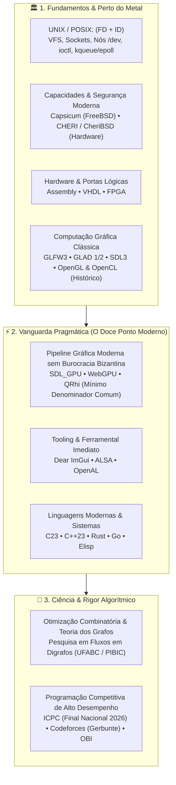

# E aí, eu sou o Gabriel Frigo! 👾

> **Estudante de Ciência da Computação e BC&T na UFABC** 
> _Baixa Abstração, Engenharia de Sistemas, Fundamentos de UNIX, Computação Gráfica & Otimização Combinatória_

Troquei as competições de matemática e astronomia (onde conquistei algumas medalhas) para me dedicar ao que realmente me move: resolver problemas de alta densidade algorítmica, codar perto do metal e entender **como as coisas realmente funcionam por baixo dos panos** — do silício ao userspace.

---

## 🧠 Filosofia de Engenharia: A Tríade Canônica

Minha atuação técnica rejeita os dois extremos rasos do desenvolvimento de software: **rejeito a alienação das caixas-pretas de altíssimo nível** (que escondem a mecânica do hardware e do kernel) e **rejeito a burocracia bizantina desnecessária** (como escrever 1.500 linhas de boilerplate manual em Vulkan ou DirectX 12 direto para desenhar uma primitiva).

Busco o **equilíbrio de ouro**: fundamentos sólidos e perenes combinados com uma vanguarda pragmática e explícita.

### 1. O Núcleo UNIX: Desmistificando o Sistema via (FD + ID) & Capabilities

Acredito que o domínio de um sistema operacional tipo Unix se resume à compreensão profunda de duas primitivas atemporais:

- **Descritores de Arquivo (FD):** Sockets _são_ descritores de arquivo. Sockets, pipes, FIFOs, arquivos no VFS, dispositivos em `/dev`, multiplexação de eventos (`kqueue`/`epoll`/`poll`) e canais de áudio (ALSA/OSS) operam todos sob a mesma semântica pura de stream e descritor.
- **Identificadores & Credenciais (ID):** O modelo de processos e isolamento (UID, GID, EUID, PID, namespaces e controle de acesso).
- **A Próxima Fronteira das Capacidades:** A evolução desse modelo em direção à segurança por privilégio mínimo:
    - _No nível de software:_ **Capsicum** (FreeBSD), eliminando o namespace global e operando estritamente sobre direitos delegados a FDs.
    - _No nível de hardware e silício:_ **CHERI** e **CheriBSD**, implementando segurança de memória com integridade de ponteiros e limites espaciais/temporais diretamente nas instruções da CPU.
- **Espírito Hacker:** O prazer de construir e entender a base, estendendo-se para **Assembly**, **VHDL** e **FPGA**.

### 2. Computação Gráfica: A GPU Moderna sem Complexidade Bizantina

- **Base Estável:** **GLFW3**, **GLAD (1 e 2)** e **SDL3** como fundações de janela, contexto e I/O.
- **Estudo Histórico e Conceitual:** **OpenGL** e **OpenCL**, preservados e estudados como marcos da transição da pipeline fixa para a programável e do surgimento da computação paralela em GPU.
- **O Ponto Ótimo Contemporâneo:** **SDL_GPU**, **WebGPU** e **QRhi**.
    - Representam exatamente como as placas gráficas funcionam hoje (pipelines imutáveis, command buffers, pass encoders, bind groups e barreiras de memória explícitas).
    - São o _mínimo denominador comum elegante_ entre Vulkan, Metal e DirectX 12 — entregando controle fino de GPU e shaders sem a burocracia bizantina de milhares de linhas de alocação de baixo nível, e anos-luz de distância da alienação de caixas-pretas de brinquedo (SFML, Raylib).
    - **Dear ImGui** para instrumentação, dashboards de engine e depuração em tempo real.

### 3. Ciência, Algoritmos & Maratonas

- **Iniciação Científica (UFABC / PIBIC):** Pesquisa focada em Problemas de Fluxos em Redes (_Network Flows_: Fluxo Máximo e Fluxo de Custo Mínimo), implementações de alta fidelidade em C++23 e testes com benchmarks canônicos da DIMACS.
- **Programação Competitiva:** Membro da equipe GRUB da UFABC. Treinamento intensivo focado na **Final Nacional do ICPC 2026**, Codeforces, Maratona Paulista e OBI.

---

## 🏛️ O Sexteto de Engenharia (Os 6 Hubs Federados)

Meu GitHub é estruturado em torno de **6 ecossistemas federados e soberanos**, cada um atuando como um hub orquestrador independente:

| Repositório Hub                                                                                                                          | Foco & Responsabilidade                                          | Tecnologias Centrais             | Componentes Canônicos                                                            |
| :--------------------------------------------------------------------------------------------------------------------------------------- | :--------------------------------------------------------------- | :------------------------------- | :------------------------------------------------------------------------------- |
|  | Orquestrador de estações de trabalho e dotfiles soberanos        | POSIX Shell, Elisp, Lua, C       | `Setup`, `Shell`, `Vault`, `Profile`, `Emacs`, `Helix`, `NeoVim`, `Vim`          |
|                         | Utilitários de sistema, elevação de privilégios e acervo técnico | C99, POSIX.1, LaTeX, Git         | `Sysutils` (`rtdo`/`rtgo`), `Library` (Acervo CS/Math), `Raw Text`               |
|             | Pesquisa acadêmica em Otimização Combinatória e Grafos           | C++23, LaTeX, DIMACS             | `Network Flow` (Fluxo Máximo e Custo Mínimo, Livro & Relatórios)                 |
|              | Hub de maratonas algorítmicas e programação competitiva          | C++23, Rust, Python, Bash        | `Algorithms` (Templates, CLI `cpt`, Handbook), `Marathon` (ICPC Nacional 2026)   |
|            | Engines de jogos, protocolos, servidores e laboratórios          | C/C++, Rust, SDL3, Lisp, Sockets | `Engines` (`RNG Engine`), `Systems` (`Posix Socket`, `SBL`, `BSD Emacs`), `Labs` |
|              | Soluções de mercado, logística operacional e produtos            | Go, Google OR-Tools, PocketBase  | `OptiLaser` (Motor de Otimização Logística VRPTW & Copiloto)                     |

---

## 🛠️ Stack Tecnológico & Domínios

### Sistemas & Perto do Metal

### Computação Gráfica, GPU & I/O

### Linguagens de Aplicação & Runtimes

---

## 📊 Métricas e Performance

  <table>
    <tr>
      <td align="center">
        
          
        
      </td>
      <td align="center" valign="middle">
        
      </td>
    </tr>
  </table>

---

## 🤝 Conexões & Presença

  
  
  
  
  

