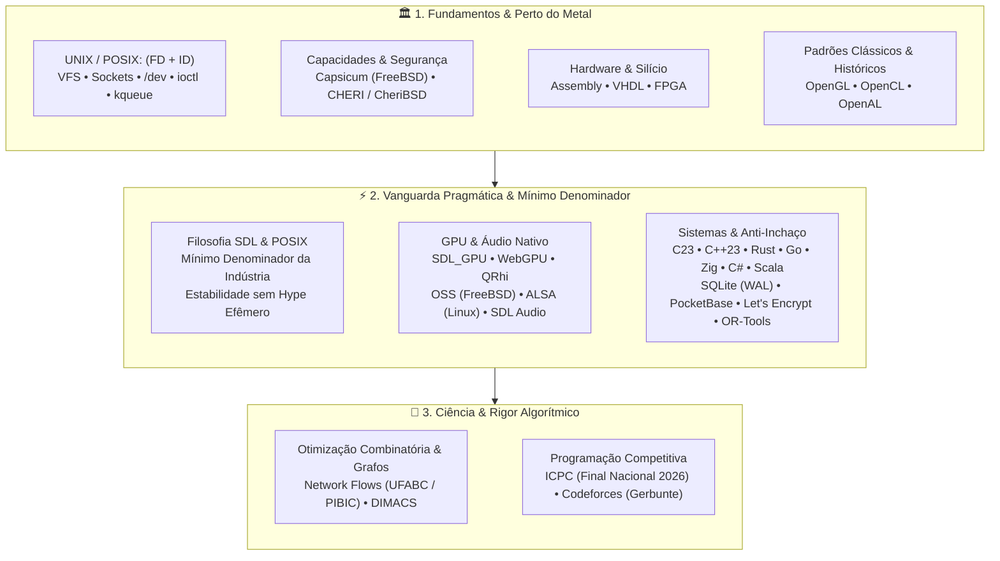

# E aí, eu sou o Gabriel Frigo! 👾

> **Estudante de Ciência da Computação e BC&T na UFABC** 
> _Baixa Abstração, Engenharia de Sistemas, Fundamentos de UNIX, Computação Gráfica & Otimização Combinatória_

Troquei as competições de matemática e astronomia (onde conquistei algumas medalhas) para me dedicar ao que realmente me move: resolver problemas de alta densidade algorítmica, codar perto do metal e entender **como as coisas realmente funcionam por baixo dos panos** — do silício ao userspace.

---

## 🧠 Filosofia de Engenharia: A Tríade Canônica

Minha atuação técnica rejeita os dois extremos rasos do desenvolvimento de software: **rejeito a alienação das caixas-pretas de altíssimo nível** (que ocultam a mecânica do hardware e do kernel) e **rejeito a burocracia bizantina desnecessária** (como escrever 1.500 linhas de boilerplate manual em Vulkan ou DirectX 12 direto para desenhar uma primitiva).

Busco o **equilíbrio de ouro**: fundamentos sólidos e perenes combinados com uma vanguarda pragmática, sem inchaço operacional.

### 1. O Núcleo UNIX: (FD + ID) & Capabilities no Software e Silício

Acredito que o domínio de um sistema operacional tipo Unix se resume à compreensão profunda de duas primitivas atemporais:

- **Descritores de Arquivo (FD):** Sockets _são_ descritores de arquivo. Sockets, pipes, FIFOs, arquivos no VFS, dispositivos em `/dev`, multiplexação de eventos (`kqueue`/`epoll`) e o subsistema de áudio nativo operam sob a mesma semântica pura de stream e descritor.
- **Identificadores & Credenciais (ID):** O modelo de processos e isolamento (UID, GID, EUID, PID, namespaces e controle de acesso).
- **A Próxima Fronteira das Capacidades:** A evolução desse modelo em direção à segurança por privilégio mínimo:
    - _No nível de software:_ **Capsicum** (FreeBSD), eliminando o namespace global e operando estritamente sobre direitos delegados a FDs.
    - _No nível de hardware e silício:_ **CHERI** e **CheriBSD**, implementando segurança de memória com integridade de ponteiros e limites espaciais/temporais diretamente nas instruções da CPU.
- **Espírito Hacker & Hardware:** Curiosidade de entender a máquina do silício ao binário com **Assembly**, **VHDL** e **FPGA**.

### 2. A Filosofia SDL & POSIX: O Mínimo Denominador Comum

Existe uma profunda simetria entre o **POSIX** e a **SDL (Simple DirectMedia Layer)**:

- Ambos se recusam a perseguir hypes passageiros ou reinventar a roda a cada ciclo da moda.
- Ambos operam como o **mínimo denominador comum** universal que permite a plataformas, drivers, displays e placas de som conversarem exatamente a mesma língua.
- Não são tecnologias defasadas: são **maduras, ultra-estáveis e impecáveis no que se propõem a fazer**.
- **A GPU Moderna sem Fricção Bizantina:** Adoção de **SDL_GPU**, **WebGPU** e **QRhi** — modelam a arquitetura real das placas modernas (pipelines imutáveis, command buffers, bind groups e barreiras explícitas) sem a burocracia de milhares de linhas de código bare-metal, e longe de caixas-pretas alienantes (SFML, Raylib).
- **Áudio Nativo no Sistema Operacional:**
    - **OSS (Open Sound System):** O padrão nativo elegante e direto do FreeBSD (`/dev/dsp`, ioctl, unix stream puro, zero sound servers intermediários).
    - **ALSA (Advanced Linux Sound Architecture):** A interface nativa de baixo nível do kernel Linux.
    - **SDL Audio:** A camada unificada e consistente do SDL3.
    - **OpenGL**, **OpenCL** e **OpenAL**: Preservados e estudados como marcos clássicos formativos da computação gráfica, GPGPU e áudio 3D.

### 3. Sistemas, Arquitetura & Filosofia Anti-Complexidade

Frameworks são passageiros; filosofias arquiteturais e linguagens robustas permanecem:

- **SQLite (WAL Mode):** O padrão definitivo de banco embutido. Zero latência de rede, zero administração de daemon, integridade ACID estrita em arquivo único no VFS.
- **PocketBase & Let's Encrypt:** Adoção pela filosofia de simplicidade e baixo atrito operacional. Go puro, SQLite WAL integrado e provisionamento automático de certificados SSL/TLS via **Let's Encrypt** nativo (sem a necessidade burocrática de proxies reversos complexos como Nginx ou Traefik em deploys autônomos). Se um serviço não exige escala planetária distribuída, não há sentido em pagar o custo cognitivo de 50 microsserviços e PostgreSQL. Cada contexto dita sua solução ideal.
- **Infraestrutura Soberana:** Uso do **FreeBSD** como sistema principal em workstation/notebook e em servidores, explorando orquestração moderna com **Sylve** (virtualização bhyve e Jails sobre ZFS), complementado por nós de computação Linux e estações Windows (MSYS2).

### 4. Ciência, Algoritmos & Maratonas

- **Iniciação Científica (UFABC / PIBIC):** Pesquisa focada em Problemas de Fluxos em Redes (_Network Flows_: Fluxo Máximo e Fluxo de Custo Mínimo), implementações de alta fidelidade em C++23 e validação com instâncias canônicas da DIMACS.
- **Programação Competitiva:** Membro da equipe GRUB da UFABC. Treinamento intensivo focado na **Final Nacional do ICPC 2026**, Codeforces, Maratona Paulista e OBI.

---

## 🏛️ O Sexteto de Engenharia (Os 6 Hubs Federados)

Meu GitHub é estruturado em torno de **6 ecossistemas federados e soberanos**, cada um atuando como um hub orquestrador independente:

| Hub                                                               | Foco & Responsabilidade                                          | Tecnologias Centrais             | Componentes Canônicos                               |
| :---------------------------------------------------------------- | :--------------------------------------------------------------- | :------------------------------- | :-------------------------------------------------- |
| [**`environment`**](https://github.com/GabrielFrigo4/environment) | Orquestrador de estações de trabalho e dotfiles soberanos        | POSIX Shell, Elisp, Lua, C       | `Setup`, `Shell`, `Vault`, `Profile`, `Editores`    |
| [**`foundation`**](https://github.com/GabrielFrigo4/foundation)   | Utilitários de sistema, elevação de privilégios e acervo técnico | C99, POSIX.1, LaTeX, Git         | `Sysutils` (`rtdo`/`rtgo`), `Library`, `Raw Text`   |
| [**`research`**](https://github.com/GabrielFrigo4/research)       | Pesquisa acadêmica em Otimização Combinatória e Grafos           | C++23, LaTeX, DIMACS             | `Network Flow` (Fluxo Máximo e Custo Mínimo, Livro) |
| [**`training`**](https://github.com/GabrielFrigo4/training)       | Hub de maratonas algorítmicas e programação competitiva          | C++23, Rust, Python, Bash        | `Algorithms` (Templates, CLI `cpt`), `Marathon`     |
| [**`personal`**](https://github.com/GabrielFrigo4/personal)       | Engines de jogos, protocolos, servidores e laboratórios          | C/C++, Rust, SDL3, Lisp, Sockets | `Engines`, `Systems`, `Labs`, `Identity`, `OSS`     |
| [**`venture`**](https://github.com/GabrielFrigo4/venture)         | Soluções de mercado, logística operacional e produtos            | Go, Google OR-Tools, PocketBase  | `OptiLaser` (Motor VRPTW & Copiloto)                |

---

## 🛠️ Stack Tecnológico & Domínios

### Sistemas Operacionais, Infra & Perto do Metal

-Supported-purple?logo=gitforwindows&logoColor=white>)

### Linguagens de Programação

### Computação Gráfica, GPU & Áudio

-purple>)
-blue>)

### Filosofia Arquitetural & Motores de Decisão

-003B57?logo=sqlite&logoColor=white>)
-B8DBE8?logo=pocketbase&logoColor=white>)
-003A70?logo=letsencrypt&logoColor=white>)

---

## 📊 Métricas e Performance

  <table>
    <tr>
      <td align="center">
        
          
        
      </td>
      <td align="center" valign="middle">
        
      </td>
    </tr>
  </table>

---

## 🤝 Conexões & Presença

  
  
  
  
  

